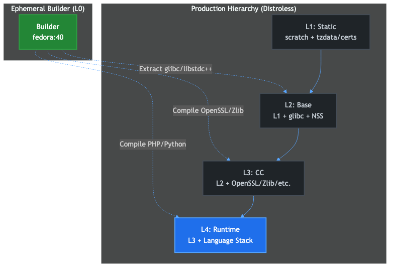

# Distroless Architecture: Technical Specification

This document defines the high-assurance architecture of the **Distroless The Hard Way** project. It combines the technical hierarchy, the dependency orchestration engine, and the core supply chain principles into a single unified reference.

---

## 1. The Unified Linear Hierarchy (The 4-Layer Model)

The architecture enforces a strictly linear cascading hierarchy modeled after Google's Distroless specifications. Each layer inherits only from its direct predecessor, ensuring absolute ABI stability and zero-trust supply chain isolation.



| Layer | Target | Role | Pipeline | Source | Inheritance |
| :--- | :--- | :--- | :--- | :--- | :--- |
| **L0** | `builder` | Toolchain Foundation | Shared | `foundations/builder.Dockerfile` | `fedora:40` |
| **L1** | `static` | System Foundations | `foundation-static` | `foundations/static.Dockerfile` | `scratch` |
| **L2** | `base` | Dynamic Foundation | `foundation-base` | `foundations/base.Dockerfile` | `static:latest` |
| **L3** | `cc` | ABI-Stabilized Base | `foundation-cc` | `foundations/cc.Dockerfile` | `base:latest` |
| **L4** | `runtime` | Language Stack | `stack-runtime` | `foundations/runtime.Dockerfile` | `cc:latest` |


### 1.1 The "Bootstrapping" Problem and the Ephemeral Builder (L0)
You might wonder: *If we compile everything from source, why do we need a Fedora base image for L0?* 
This solves the classic "bootstrapping" problem. To compile C/C++ software, you need an existing C compiler (`gcc`), linker, kernel headers, and build tools (`make`, `cmake`). Compiling a compiler from absolute scratch requires an existing host compiler. 
We utilize `fedora:40` strictly as our **ephemeral host toolchain**. It provides the robust `gcc` and `glibc` development headers needed to compile our custom OCI Atoms. Crucially:
- **Zero Leakage**: The final production layers (L1-L4) inherit from `scratch` (via `static`), not from `fedora:40`. The `builder` image is entirely discarded after the compilation phase.
- **Controlled Extraction**: The only components explicitly extracted from the `builder` into our `base` (L2) are the essential `glibc` shared objects (e.g., `libc.so.6`, `ld-linux.so`) needed to run dynamically linked binaries. This guarantees a pure distroless environment with zero Fedora package manager or shell remnants in production.

### FHS Unification & Distroless Alignment (vs Google Distroless)
While modeled after Google's Distroless images (e.g., `gcr.io/distroless/static`, `base`, `cc`), our architecture introduces a fundamentally more robust and modular approach:
1. **FHS Symlink Preservation**: Like standard minimal container filesystems, we strictly enforce FHS root symlinks (`/lib -> /usr/lib`, `/lib64 -> /usr/lib64`). Crucially, these are declared once in the `base` image and never overwritten by subsequent layer copies (such as `cc`), preventing Buildkit filesystem degradation and directory replacement errors.
2. **Modular `cc` Layer (OCI Atoms)**: Unlike Google's monolithic `cc` image containing a fixed set of libraries (e.g., `libstdc++`, `libgcc`), we compile independent OCI Atoms. The engine composes a tailored `cc` stage per-runtime (e.g., `cc-php`), embedding only the dynamically linked dependencies actually required by that specific language stack.
3. **Pure Language Runtimes**: Similar to `gcr.io/distroless/python3`, our final runtime stages inject only the strictly necessary, source-compiled binaries (linked via RPATH), maintaining 100% distroless purity without any OS package manager remnants.

### 📂 Canonical Filesystem Layout (`cc` layer)
Every image adheres to the following layout before the language runtime is injected:

```text
/
├── etc/
│   ├── ld.so.conf              # Dynamic Linker Configuration
│   ├── os-release              # OS Metadata
│   ├── passwd                  # root(0), nonroot(65532)
│   ├── group
│   └── ssl/
│       └── certs/
│           └── ca-certificates.crt # Root Trust Store
├── home/
│   └── nonroot/                # Owned by UID 65532
├── lib -> usr/lib              # Legacy Library Symlink
├── lib64 -> usr/lib64          # 64-bit ABI Symlink (Fedora compat)
├── tmp/                        # Permissions: 1777 (Sticky)
├── usr/
│   ├── bin/
│   │   └── busybox             # Only in :debug variants
│   ├── lib/                    # Standard Library Path
│   │   └── (32-bit/Universal)
│   ├── lib64/                  # Primary 64-bit Library Path
│   │   ├── ld-linux-x86-64.so.2 # Glibc Dynamic Linker
│   │   ├── libc.so.6           # Glibc Core
│   │   ├── libcrypto.so.3      # OpenSSL
│   │   ├── libssl.so.3         # OpenSSL
│   │   ├── libstdc++.so.6      # GCC Runtime
│   │   └── libz.so.1           # Zlib
│   └── share/
│       └── zoneinfo/           # Timezone Database
└── var/
    └── lib/
        └── apt/
            └── lists/          # Empty (Distroless spec)
```

---

## 2. Security & Supply Chain Integrity

### 2.1 Zero-Trust Principles
- **Zero OS Extraction**: No reliance on host OS package managers.
- **Rpath Pinning**: Binaries are compiled with `-Wl,-rpath,/usr/lib` to ensure they only load high-assurance libraries.
- **Shell-Free Production**: Standard images contain zero executables (`no sh`, `no ls`).

### 2.2 Compliance & Attestation
- **License Harvesting**: Automated extraction of licenses into `/usr/share/doc/`.
- **Keyless Signing**: Full Sigstore/Cosign integration using GitHub OIDC identity.
- **SLSA Level 3**: Cryptographic provenance attestations for every layer, linked to the specific image digest.

### 2.3 Debugging Strategy
Troubleshooting tools (Busybox) are strictly isolated into `:debug` tagged variants. These are generated from the same secure hierarchy but include a non-root-accessible diagnostic environment.

---

## 3. Sourcing Strategy: Source-Built vs. Binary Injection

The project implements a hybrid sourcing strategy for the final language runtimes (L4). This division is a deliberate architectural and educational decision designed to teach core systems engineering principles without introducing prohibitive compiler maintenance overhead.

### 3.1 Educational Goals & Sourcing Boundary
The primary objective of the **Distroless The Hard Way** curriculum is to teach:
- Constructing minimal filesystem structures from absolute scratch.
- Dynamic library dependency mapping and dynamic link loader (`ld.so`) configuration.
- Shared directory preserving strategies (e.g., FHS symlink preservation) in unified OCI layers.

Bootstrapping massive compiler ecosystems from absolute source (such as compiling the V8 JavaScript compiler, the OpenJDK C++ virtual machine, or the .NET Core CLR toolchain) requires extreme resources, long compile times, and highly specific bootstrap compilers. Since this toolchain compilation overhead occurs inside a container and does not offer additional educational value regarding final OCI layer structure, the project establishes a pragmatic boundary between compiled runtimes and injected runtimes.

### 3.2 Source-Built Runtimes (Python, PHP, Perl)
These stacks are compiled directly from upstream source code tarballs using the ephemeral Fedora toolchain:
- **Python**: Compiled from source to ensure proper binding with our CC foundation libraries (OpenSSL, SQLite, zlib) and to enable custom optimization flags.
- **PHP**: Compiled from source due to tight integration requirements with modular dependencies (curl, xml, mbstring, pcre2) and custom module linkage paths.
- **Perl**: Compiled from source due to strict system path bindings and localized dynamic library loading constraints.

### 3.3 Binary Injection Runtimes (Java, Node.js, .NET)
These stacks utilize clean, pre-compiled binary archives provided directly by upstream distributors (Microsoft, NodeUpstream, Adoptium):
- **Node.js**: Upstream provides highly optimized standalone binary archives. Avoiding V8 source compilation reduces build times from several hours to seconds, focusing learning on dynamic library resolution via `ldd`.
- **Java**: Leverages official, tested OpenJDK binaries to bypass the massive bootstrap compiler loop required to compile the HotSpot VM.
- **.NET**: Injecting official Microsoft .NET Core runtimes bypasses the complex, platform-specific bootstrapping loop of the Roslyn compiler.

This hybrid approach ensures high-assurance supply chain control while keeping compile times realistic for local development and CI/CD runs.

---

> For details on the build scripts and orchestration, see the **[Distroless Engine Documentation](ENGINE.md)**.
> For details on the CI/CD workflows, see the **[Pipelines Documentation](PIPELINES.md)**.
