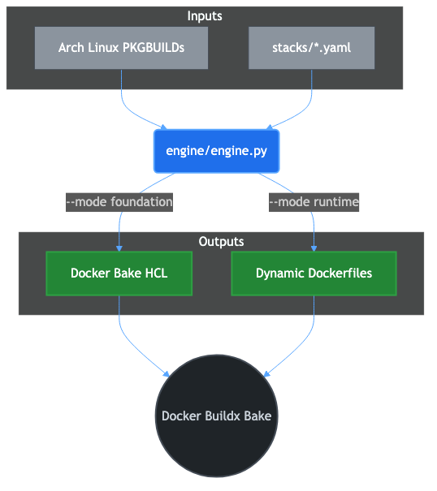

# The Distroless Engine

The **Distroless Engine** (`engine/engine.py`) is the core orchestration script of this project. Instead of relying on manual `RUN apt-get install` commands or fragile bash scripts, the engine dynamically generates complex Docker Bake (HCL) manifests and Dockerfiles by analyzing primary intelligence sources.

---

## 1. How it Works



The engine bridges the gap between raw source code and distroless OCI images. It parses declarative configuration files (`stacks/*.yaml`) and maps them against Arch Linux `PKGBUILD` scripts to automatically resolve dependencies and extract optimized `./configure` compilation flags.

---

## 2. Operating Modes

The engine operates in two strictly separated modes to enforce the 4-layer architectural hierarchy:

### `--mode foundation`
This mode targets the bottom layers of the stack (`L1` to `L3`). 
It analyzes the foundational dependencies required by all language runtimes (such as `zlib`, `openssl`, `libxcrypt`) and outputs a unified manifest: `foundations/foundations.hcl`. This manifest instructs Docker Buildx on how to compile these C/C++ libraries into a stable `cc` base image.

**Command:**
```bash
python3 engine/engine.py --mode foundation
```

### `--mode runtime`
This mode targets the final language stack (`L4`). 
It reads a specific YAML configuration file and generates an "Apko-style" declarative assembly manifest (e.g., `foundations/php.hcl`). It leverages the pre-built `cc` layer and compiles/injects only the specific binaries needed for the language, yielding a pure, shell-less runtime image.

**Command:**
```bash
python3 engine/engine.py --mode runtime --stack stacks/php.yaml
```

---

## 3. Configuration Stacks (`stacks/*.yaml`)

Language runtimes are defined via simple YAML files. The engine parses these files to determine what needs to be built.

**Example: `stacks/php.yaml`**
```yaml
stack: php
version: 8.3
packages:
  - name: php
    source_build: true
    dependencies:
      - curl
      - openssl
      - zlib
      - libxcrypt
```

- `source_build: true`: Instructs the engine to download the source tarball, parse the Arch Linux `PKGBUILD`, and compile it from scratch inside the builder layer.
- `dependencies`: Lists the required OCI Atoms (foundations). The engine automatically ensures these are built and linked securely.

---

## 4. Arch Linux Intelligence

A unique feature of the Distroless Engine is its integration with Arch Linux. The engine fetches raw `PKGBUILD` files from the Arch Linux package repository to extract:
1. The exact upstream source URL for a given package version.
2. The optimal, industry-standard `./configure` flags used by Arch Linux maintainers.

This ensures our source-built packages are highly optimized and secure without requiring us to manually guess the compilation flags for complex libraries like `openssl` or `curl`.
