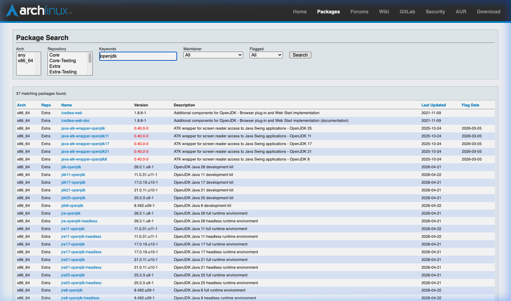
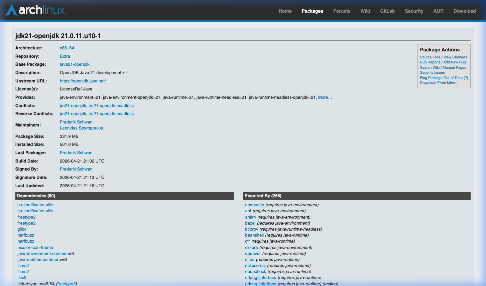

# Onboarding Guide: Adding New Stacks

This guide explains how to add a new language runtime or technology stack to the modular Distroless architecture.

## Workflow Overview

Adding a new stack follows a 4-step process: **Discovery** -> **Definition** -> **Generation** -> **Validation**.

---

## Step 1: Discovery
Use the `discovery_cli.py` tool to automatically identify the necessary dependencies and build configurations from upstream sources (Arch Linux PKGBUILDs).

```bash
python3 engine/discovery_cli.py --name openjdk
```

The tool will output a proposed YAML structure. Note down the `dependencies` list.

## Step 2: Definition
Create a new file in the `stacks/` directory: `stacks/<your-stack>.yaml`.

### Example Structure:
```yaml
name: java
version: "21.0.2"
type: source_build
base_hierarchy:
  - static
  - base
  - cc

dependencies:
  - name: zlib
    version: "latest"
  - name: freetype2
    version: "latest"
  # Add other discovered dependencies here

runtime:
  name: openjdk
  version: "21.0.2"
  source_url: "https://github.com/openjdk/jdk21u/archive/..."
  build_flags: ["--with-zlib=system", "--with-freetype=system"]
```

## Step 3: Generation
Run the build engine to generate the HCL orchestration and the localized Dockerfiles.

```bash
python3 engine/engine.py --mode runtime --stack stacks/<your-stack>.yaml
```

This will create:
- `foundations/<your-stack>.hcl`: The Bake orchestration file.
- `foundations/cc-<your-stack>.Dockerfile`: The compiler container for this specific stack.

## Step 4: Validation & CI
Before pushing, you can verify the generation locally:

```bash
# Verify HCL generation with registry bypass
python3 engine/engine.py --mode runtime --stack stacks/<your-stack>.yaml --force-build
```

### Automatic CI Trigger
Once you commit and push the `stacks/<your-stack>.yaml` file:
1. The **Full Fleet Build** workflow will automatically detect the new file.
2. It will trigger a parallel build for the new stack.
3. If dependencies (Atoms) are missing in the registry, it will build them from source.
4. The final image will be **signed** with Cosign and get **SLSA Level 3** provenance.

---

## Troubleshooting: Empty Discovery Output

If `discovery_cli.py` returns an empty `dependencies` list or `SKIP` values, it means the package name provided does not match the upstream repository name exactly.

### How to find the correct name:
The discovery tool fetches `PKGBUILD` files from the official Arch Linux GitLab. Often, multiple packages (like `jdk21-openjdk`, `jre21-openjdk`, `jre21-openjdk-headless`) are built from a single **Base Package** (also known as Source Package). You must provide the name of this Base Package to the tool.

1. Go to [Arch Linux Package Search](https://archlinux.org/packages/).
2. Search for the runtime you want (e.g., `openjdk`).
   
   
   *Figure 1: Multiple results for 'openjdk' search.*

3. In the results list, click on the specific version you need (e.g., `jdk21-openjdk`).
4. On the package details page, look at the **Package Details** sidebar or the header.
5. Identify the **Base Package** field. 
   
   
   *Figure 2: The 'Base Package' field highlights the correct name for discovery (java21-openjdk).*

6. Use this name with the discovery tool:
   ```bash
   python3 engine/discovery_cli.py --name java21-openjdk
   ```

> [!TIP]
> If you are unsure, look for the "Source Files" link on the same page; it will lead you to the GitLab repository whose name you should use.
5. Re-run the discovery tool using that name:
   ```bash
   python3 engine/discovery_cli.py --name java-openjdk
   ```

---

## Tips for Success
- **Atom Reuse**: Always check if a dependency is already available as an Atom (e.g., `openssl`, `zlib`, `icu`).
- **Build Flags**: Ensure the runtime is configured to use "system" libraries (the Atoms) instead of bundled ones.
- **Paths**: The engine installs everything under `/opt/distroless`. Ensure your runtime points there for dependencies.
