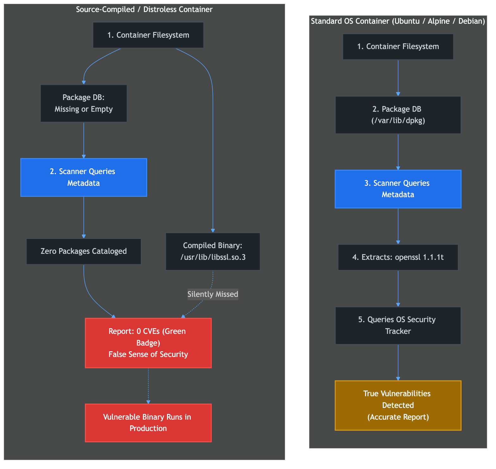
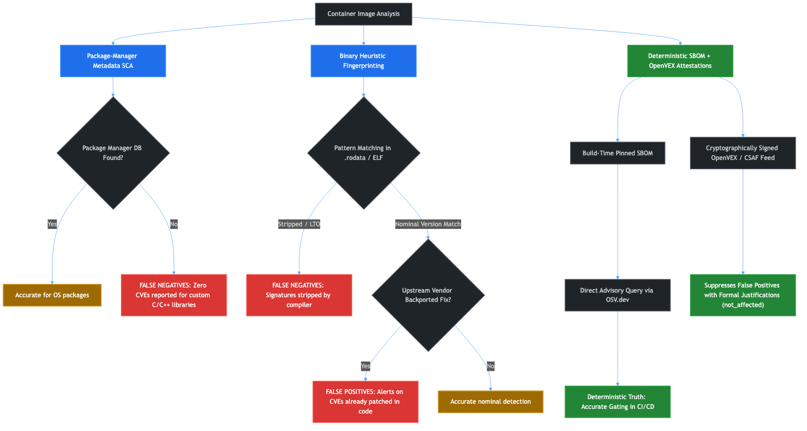
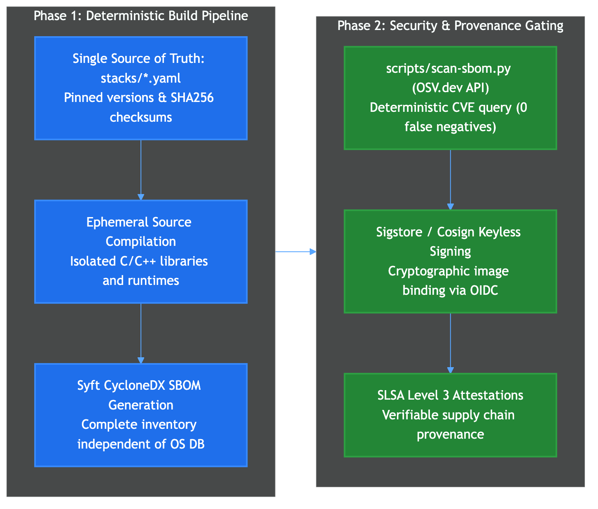

# The Container Vulnerability Scanning Paradox: Technical Analysis of Custom Binaries, Minimalist Images, and Detection Limits

This document analyzes vulnerability scanning (CVE detection) within distroless, minimalist, and source-compiled container images. It explains the mechanics of traditional scanners, the architectural causes of false negatives and false positives, the impact of security patch backporting, and how modern standards such as OpenVEX and build-time SBOM auditing resolve these limitations.

---

**New here? Read this first.** The short version: a scanner reporting "0 vulnerabilities" on a distroless or source-compiled image usually does not mean the image has no vulnerable code — it more often means the scanner had nothing it knew how to check. The rest of this document explains why, compares the detection methods that do and don't work, and describes what this project does about it today, including where that coverage still falls short (§7.5).

**Key terms, defined once so the tables below read standalone:**
- **SCA (Software Composition Analysis)**: scanning that identifies *which* open-source components are inside an image — typically by reading a package manager's own installed-package database.
- **CVE (Common Vulnerabilities and Exposures)**: a public, uniquely-numbered record of a known security flaw in a specific piece of software.
- **SBOM (Software Bill of Materials)**: a structured, machine-readable inventory of every component that went into building an artifact — the input a vulnerability audit should ideally check against.
- **ELF (Executable and Linkable Format)**: the standard binary file format used by compiled programs and shared libraries (`.so` files) on Linux.
- **VEX (Vulnerability Exploitability eXchange)**: a signed statement from a software producer declaring whether a specific CVE actually affects a specific build of their product.
- **CFG (Control-Flow Graph)**: a map of every possible execution path through a compiled function, used to verify structurally whether a security fix's logic is actually present in the machine code.
- **eBPF**: a Linux kernel technology that lets tools observe exactly which code paths a running program executes, without modifying it.

---

## 1. The Core Problem: The Green Badge Illusion

In Cloud-Native engineering and DevSecOps pipelines, container vulnerability scanning is a standard gating control. Teams rely on automated scanner reports (e.g., Trivy, Grype, Snyk) to block images with known Common Vulnerabilities and Exposures (CVEs). When an image scan returns zero vulnerabilities, pipelines display a clean report—a "Green Badge".

In minimalist environments (such as scratch, distroless images, or containers assembled from custom-compiled binaries), this Green Badge frequently represents an architectural blind spot rather than an absence of security defects:

1. **Absence of Proof is Not Proof of Absence**: Conventional scanners do not analyze executable machine code by default; they query the internal databases of operating system package managers.
2. **The Metadata Disconnect**: If a shared library (such as `libssl.so` or `libxml2.so`) is compiled directly from source code and copied into `/usr/lib`, it exists on the filesystem and executes at runtime. However, because no package manager installed it, no record exists in system tracking registries.
3. **Silent Failure**: The scanner evaluates the image, discovers zero indexed packages, and reports zero vulnerabilities. The container passes the compliance gate while potentially running outdated, vulnerable binary code in production.



---

## 2. Taxonomy of Vulnerability Detection Methodologies

Vulnerability detection tools operate across distinct architectural layers, each with specific assumptions, operational trade-offs, and failure modes:

| Detection Paradigm | Primary Mechanism | Example Tools | Operating Speed | Key Failure Mode |
| :--- | :--- | :--- | :--- | :--- |
| **Package-Manager Metadata SCA** | Parses OS package databases and language runtime manifests; some tools fall back to a curated binary-signature list when no package database is found (see §3.3). | Trivy, Grype, Snyk, Clair | Seconds | **False Negatives** on any binary outside the package database *and* outside the tool's curated fallback list — near-total for Trivy/Snyk on custom C libraries, partial for Grype (via Syft). |
| **Binary Static Heuristics** | Scans ELF headers, string constants, and regex patterns in data segments. | cve-bin-tool, Binwalk | Seconds to Minutes | **False Positives** on backported code; **False Negatives** on stripped binaries. |
| **Control-Flow Graph (CFG) Diffing** | Compares assembly graph structures to verify patch instructions. | Ghidra, IDA Pro / BinDiff | Hours per binary | High computational complexity; impractical for continuous CI/CD gating. |
| **Dynamic Reachability Tracing** | Monitors dynamic symbol execution and kernel syscalls at runtime. | strace, ltrace, Linux eBPF | Continuous / Test Runs | Only verifies code paths executed during the monitored test workload. |
| **Declarative Trust & VEX** | Ingests cryptographically signed vendor patch declarations. | OpenVEX, CSAF, Cosign | Milliseconds | Relies on vendor discipline and verified build chain provenance. |

---

## 3. Package-Manager Metadata Scanners (The Blind Spot — With a Curated Exception)

The vast majority of container security scanners used in CI/CD pipelines (including Trivy, Grype, Clair, and commercial platforms) rely primarily on Software Composition Analysis (SCA) driven by metadata inspection. §3.1 and §3.2 describe that primary mechanism, which is where most of these tools stop. §3.3 documents a narrower but real exception: Grype (via its underlying SBOM generator, Syft) also ships a curated *binary classifier* that fingerprints a specific, limited list of well-known binaries even with no package database present.

### 3.1 Operational Mechanism
To identify installed software, the scanner executes the following sequence:
1. **Operating System Identification**: The scanner inspects `/etc/os-release` or `/usr/lib/os-release` to identify the distribution identifier (`ID=debian`, `ID=alpine`, `ID=rhel`).
2. **Registry Parsing**: The scanner parses the designated package database for that OS family:
   - Debian / Ubuntu: `/var/lib/dpkg/status` or `/var/lib/dpkg/status.d/*`
   - Alpine Linux: `/lib/apk/db/installed`
   - Red Hat / Fedora: `/var/lib/rpm/rpmdb.sqlite` or `/var/lib/rpm/Packages`
3. **Application Manifest Parsing**: The scanner checks for known language lockfiles (`package-lock.json`, `Gemfile.lock`, `Pipfile.lock`, `poetry.lock`, Go buildinfo embedded in binaries).
4. **Advisory Correlation**: The scanner queries OS-specific security trackers (e.g., Debian Security Bug Tracker, Alpine SecDB, Red Hat OVAL feeds) using the exact package name and package release version string.

### 3.2 The Cause of Failure in Distroless Environments
In a pure distroless or source-compiled container (such as those assembled by this project or custom minimal root filesystems):
- Package managers (`dpkg`, `apk`, `rpm`) are intentionally excluded to minimize attack surface.
- The database directories (`/var/lib/dpkg`, `/lib/apk/db`) do not exist.
- Shared libraries (`libcrypto.so.3`, `libz.so.1`, `libcurl.so.4`) are placed directly into `/usr/lib`.
- Scanners with no fallback mechanism (Trivy, Snyk, Clair, for the vast majority of custom-compiled C libraries) evaluate the filesystem, find no package database, and conclude that no system packages are installed. The scan completes with an exit code of `0` and reports zero vulnerabilities. Outdated or critically flawed libraries remain entirely undetected.
- Grype does not stop there — see §3.3.

### 3.3 The Curated Exception: Binary Classifiers in Grype (via Syft)
Not every package-metadata scanner is *completely* blind. Grype generates its internal component inventory using **Syft**, and Syft ships a `binary` cataloger: it looks for files matching known name patterns and applies a regular expression to extract a version string directly from the binary's `.rodata`/`.data` sections — the same fingerprinting technique used by `cve-bin-tool` (§4). Coverage is a curated, hand-maintained list, not a general solution: as of this writing, Syft's classifiers cover roughly 60 specific tools/runtimes (OpenJDK, Python, Node.js, Perl, Go, nginx, Redis, PostgreSQL, and more — see [anchore/syft `binary/classifiers.go`](https://github.com/anchore/syft/blob/main/syft/pkg/cataloger/binary/classifiers.go)), not arbitrary compiled `.so` files.

Cross-referencing that list against this project's own foundation Atoms and runtimes (verified against the live Syft source, not documentation, since the curated list changes frequently):

| Component | Detected by Grype/Syft's binary classifier? |
| :--- | :--- |
| `openssl`, `curl`, `xz`, `krb5` | **Yes** — dedicated classifiers exist for each. |
| Python, Node.js, Perl, Java/OpenJDK runtimes | **Yes** — each has a dedicated classifier (Java's is unusually specific: it distinguishes OpenJDK, GraalVM, Zulu, and Oracle builds). |
| `zlib`, `ncurses`, `readline`, `sqlite`, `libxcrypt`, `libffi`, `expat`, `bzip2`, `icu`, `brotli`, `c-ares`, `nghttp2`, `libxml2`, `pcre2`, `oniguruma` | **No** — no classifier exists; these remain invisible to Grype exactly as described in §3.2. |
| PHP interpreter, .NET runtime | **No** — Syft has a classifier for the `php-composer-binary` tool, but not for the `php` interpreter itself; no `.NET` classifier exists. |

**The important nuance**: for the handful of components Grype *does* detect this way, it does not magically become accurate — it inherits the exact same heuristic weaknesses described in §4.2 and §4.3 (false positives on backported patches, false negatives on stripped binaries), because it is using the same technique. A "Grype found it" result on `openssl` is not more trustworthy than a `cve-bin-tool` result; it is the *same* result. This project does not currently backport patches into its Atoms (it always builds the latest pinned upstream version — see §7.5), so in practice a Grype scan of these specific eight components is likely to be reasonably accurate today; that is a property of this project's build policy, not of Grype's detection method.

**Trivy and Snyk have narrower, differently-shaped exceptions**, not the same mechanism as Grype:
- **Trivy** looks up a binary's cryptographic hash in Sigstore's **Rekor** transparency log; if that exact binary was previously published alongside a known SBOM, Trivy reuses it. This only works for binaries someone has already published provenance for — Trivy's own documentation states it "doesn't support third-party/self-compiled packages/binaries." It also has dedicated support for extracting embedded module info from compiled **Go** binaries specifically. Neither mechanism applies to this project's source-compiled C Atoms.
- **Snyk Container** does file-fingerprint-based detection for **unmanaged binaries**, but its own documentation scopes this to two runtimes: Node.js and the Java Runtime Environment. Everything else — including every C library Atom in this project — falls back to pure package-manager metadata, i.e., the blind spot in §3.2.

### 3.4 SBOM-First Scanning: Bypassing Filesystem Detection Entirely
Every limitation in §3.1–§3.3 stems from the same root cause: the scanner has to *discover* what is inside the image by inspecting it. Both Grype and Trivy support a fundamentally different mode that sidesteps discovery altogether — feeding the scanner an already-accurate SBOM instead of asking it to derive one from the filesystem:
- `grype sbom:./my-sbom.json` and `trivy sbom ./my-sbom.json` match a pre-generated CycloneDX or SPDX file directly against their vulnerability databases, skipping filesystem/binary detection entirely (both also accept the SBOM piped via stdin).
- If that SBOM is authored from the actual build specification (the exact upstream package names and pinned versions the build used) rather than reconstructed by scanning compiled artifacts, the entire blind spot in §3.2 does not apply — the scanner is never asked to *guess* what a `.so` file is, it is told.
- Grype's `--fail-on <severity>` flag is what turns this from a report into an actual CI-blocking control, independent of how the input SBOM was produced.
- **Limitation**: accuracy is only as good as the SBOM's fidelity to the real build — a stale or hand-maintained manifest silently reintroduces the same blind spot from a different angle.

**Why this is directly relevant here**: this project already has both halves of this pattern built, just not connected. `scripts/scan-sbom.py` (§7.3) already derives accurate package/version data straight from `stacks/*.yaml` — the exact kind of build-derived source this technique needs. The CI pipeline already runs Grype (§7.5) — just against the built filesystem, not against that accurate data. Generating a CycloneDX SBOM from the stack manifests and feeding it to `grype sbom:... --fail-on critical` would unify the two into one real, blocking gate, rather than two separate, non-blocking checks. This is currently unimplemented — see §7.5.

---

## 4. Binary Heuristic Scanners (The Heuristic Dilemma)

To address the blindness of package metadata scanners, binary analysis scanners (such as `cve-bin-tool`, maintained under Intel and OpenSSF governance) analyze compiled executable files directly (ELF, PE, Mach-O formats). Its checker library covers 350+ components — including several C libraries that fall outside Grype's curated binary classifier (§3.3), such as `zlib`, `libxml2`, `sqlite`, and `ncurses` — making it the broadest-coverage option discussed in this document for a custom, source-compiled C/C++ toolchain, at the cost of the false-positive risk described below.

### 4.1 Heuristic Inspection Mechanics
Binary heuristic tools operate without requiring a package database:
1. **Section Scanning**: The scanner parses the target binary's Executable and Linkable Format (ELF) structure, focusing on the `.rodata` (read-only data), `.data`, and `.dynsym` (dynamic symbol) sections.
2. **Pattern Matching**: Specialized signature modules apply regular expressions calibrated against known library formats. For instance, scanning an OpenSSL binary for signatures matching `OpenSSL [0-9]\.[0-9]\.[0-9][a-z]*` or copyright banners containing version tags.
3. **CPE Correlation**: Once a product-version pair is deduced (e.g., `cpe:2.3:a:openssl:openssl:3.0.2:*:*:*:*:*:*:*`), the finding is checked against a local database aggregated from five sources — not NVD alone: **NVD**, Google's **OSV**, the **GitLab Advisory Database (GAD)**, **Red Hat**'s own CVE feed, and a dedicated **curl** feed. NVD supplies the majority of entries and resolves the CPE identifier; OSV and GAD add ecosystem CVEs NVD sometimes lacks.

### 4.2 Failure Mode 1: Compiler Stripping and Optimization (False Negatives)
Binary fingerprinting relies on readable string constants surviving the build process. Modern compiler flags frequently remove or alter these markers:
- **Symbol Stripping** (`strip --strip-all`): Removes symbol tables (`.symtab`, `.strtab`), preventing symbol-based resolution.
- **Link-Time Optimization (LTO)** (`-flto`): Inlines functions and eliminates unreferenced string constants across translation units.
- **Compiler Dead-Code Elimination**: If a version string banner is never referenced by an active code path, the compiler discards it from `.rodata`.
When signatures are missing or fragmented, binary scanners bypass the library, producing false negatives.

### 4.3 Failure Mode 2: The Backporting Dilemma (Chronic False Positives)
The most severe limitation of binary fingerprinting occurs when interacting with distributions and vendors that practice **security backporting** (such as Chainguard, Wolfi, Debian Security Team, Ubuntu Security, and Red Hat Enterprise Linux).

#### The Mechanics of Backporting
Enterprise operating systems and security-hardened distributions prioritize Application Binary Interface (ABI) and Application Programming Interface (API) stability. Upgrading a core component from `3.0.2` to `3.0.15` to resolve a vulnerability risks introducing breaking behavioral changes or modifying shared object sonames.

Instead of advancing to a new upstream version, maintainers perform backporting:
1. They isolate the specific patch commit addressing the CVE from upstream source control.
2. They apply that isolated commit retroactively to the older source code baseline.
3. They increment their distribution-specific release tag (e.g., `3.0.2-1+deb11u1` or a custom vendor release hash) while leaving the internal upstream version string (`3.0.2`) intact in the binary's `.rodata` segment.

#### The Resulting Failure
A binary heuristic scanner inspects the backported library, reads the internal string literal `OpenSSL 3.0.2`, and flags every CVE disclosed for OpenSSL between version `3.0.2` and the latest release.

The scanner cannot determine whether the vulnerability patch instructions are present in machine code. The result is **chronic false positive noise**, inundating security teams with alerts for vulnerabilities that have already been remediated in the codebase.



---

## 5. The Chainguard and OpenVEX Paradigm: Resolving False Positives

Hardened container image providers (such as **Chainguard** and the **Wolfi** Linux ecosystem) compile minimalist packages and actively backport security fixes. Because their images trigger frequent false alarms in standard scanners that inspect nominal versions, they rely on standardized **VEX (Vulnerability Exploitability eXchange)** documentation.

### 5.1 The OpenVEX Standard
OpenVEX is an open-source, vendor-neutral specification designed under the OpenSSF to provide machine-readable attestations regarding whether a product is affected by a specific vulnerability.

An OpenVEX document is structured as a signed JSON-LD record containing explicit statements:

```json
{
  "@context": "https://openvex.dev/ns/v0.2.0",
  "@id": "https://chainguard.dev/vex/openvex-openssl-patch.json",
  "author": "Chainguard Security Team",
  "timestamp": "2026-03-15T10:00:00Z",
  "statements": [
    {
      "vulnerability": {
        "name": "CVE-2023-0286"
      },
      "products": [
        {
          "@id": "pkg:apk/wolfi/openssl@3.0.8-r1"
        }
      ],
      "status": "not_affected",
      "justification": "inline_mitigations_already_exist",
      "impact_statement": "The security patch commit was backported directly into package revision 3.0.8-r1 before compilation."
    }
  ]
}
```

### 5.2 Standard VEX Statuses and Justifications
OpenVEX defines four mutually exclusive statuses for each declared vulnerability:
- `not_affected`: The software is not impacted by the CVE. Requires an approved justification:
  - `component_not_present`: The vulnerable sub-module was omitted during compilation.
  - `vulnerability_code_not_present`: The code was patched or removed.
  - `inline_mitigations_already_exist`: Backported patches resolve the condition.
  - `vulnerability_code_cannot_be_controlled_by_adversary`: The execution path is unreachable.
- `affected`: The vulnerability is present and exploitable; remediation is pending.
- `fixed`: The vulnerability was remediated in the specified artifact build.
- `under_investigation`: The vendor is currently assessing impact.

### 5.3 Scanner Ingestion and Automated Suppression
When modern scanners (such as Grype, Trivy, or specialized compliance engines) evaluate a container accompanied by an OpenVEX document:
1. The scanner detects nominal matches based on version rules.
2. It ingests the cryptographic VEX feed associated with the image (verified through Sigstore/Cosign).
3. Where a valid `not_affected` statement exists with an accredited justification, the scanner suppresses the alert automatically.
4. The resulting report reflects true exposure, eliminating false positive alerts while maintaining strict security verification.

---

## 6. Advanced Verification: Beyond Heuristic Approximations

When source code or vendor attestations are unavailable, validating whether a binary contains a specific security fix requires deeper technical inspection.

### 6.1 Control-Flow Graph (CFG) Patch Diffing
Binary patch diffing provides mathematical verification of patch presence in compiled machine code:
1. **Upstream Commit Isolation**: The engineer isolates the upstream source commit addressing the CVE (e.g., the introduction of an integer overflow boundary check in a parsing routine).
2. **Reference Compilation**: Two reference binaries are compiled from source with identical compiler flags and architecture: one pre-patch, one post-patch.
3. **Graph Decomposition**: Disassemblers (e.g., **Ghidra**, **IDA Pro** with **BinDiff**) decompile the binaries into basic blocks, generating directed Control-Flow Graphs (CFGs).
4. **Graph Isomorphism & Instruction Comparison**: BinDiff calculates graph isomorphism algorithms across the target function. It identifies whether the compiled target contains the added conditional branch (`cmp`/`test` followed by `jne`/`je`) introduced by the security fix.

*Operational Constraint*: CFG diffing is computationally expensive, requires manual assembly analysis, and cannot be scaled across continuous automated CI/CD pipelines scanning hundreds of images daily.

### 6.2 Dynamic Runtime Tracing and Reachability Analysis
Rather than analyzing static binary files at rest, reachability analysis evaluates active execution in a sandbox environment:
- **System Call Tracing (`strace`)**: Monitors interactions between the binary and the Linux kernel, detecting file access and network socket allocations.
- **Dynamic Symbol Interception (`ltrace`)**: Intercepts the Procedure Linkage Table (PLT) to record which exported shared library functions are dynamically resolved during execution.
- **Linux eBPF Probes**: Extended Berkeley Packet Filter programs attached to kernel kprobes or userspace uprobes trace exact instruction branches in memory. If a vulnerable function within `libcrypto.so` is loaded into disk storage but never called by the application runtime during traffic execution, the vulnerability is classified as unreachable, deprioritizing immediate incident response overhead.

---

## 7. The Distroless The Hard Way Approach: Deterministic Auditing

The **Distroless The Hard Way** project compiles its foundational shared libraries and selects runtimes directly from upstream source tarballs, deliberately omitting OS package managers. To eliminate both the false negatives of traditional metadata scanners and the false positives of binary heuristics, the project implements a deterministic audit model.



### 7.1 Single Source of Truth Build Specifications
All foundational packages are declared in version-controlled YAML files (`stacks/*.yaml` and `foundations/`). Each component includes:
- Exact upstream package name (e.g., `openssl`, `zlib`, `curl`, `sqlite`).
- Immutable pinned version tag (e.g., `3.4.0`, `1.3.1`).
- Upstream source archive SHA256 checksum.

### 7.2 Deterministic SBOM Generation (Syft)
During the build process, **Syft** generates a comprehensive **CycloneDX Software Bill of Materials (SBOM)** derived directly from the build specification manifests. Every source-compiled `.so` library is mapped to its verified upstream component identity and version, independent of OS package manager records.

### 7.3 Direct OSV.dev API Auditing
The repository provides a dedicated security auditing script, **[scripts/scan-sbom.py](../scripts/scan-sbom.py)**:
- Parses the exact pinned package names and versions directly from the stack specifications.
- Issues automated, structured HTTPS requests to Google's **OSV.dev** (Open Source Vulnerabilities) API (`https://api.osv.dev/v1/query`).
- Retrieves active CVE and GHSA records matching the exact software releases with zero reliance on local filesystem heuristics.
- Delivers a deterministic security audit report with zero false negatives.

### 7.4 Cryptographic Attestations (Sigstore / SLSA Level 3)
The resulting OCI images are cryptographically signed using **Cosign** through keyless GitHub OIDC tokens, accompanied by non-falsifiable **SLSA Level 3** build provenance attestations pushed to the registry alongside the image. Downstream consumers can verify that the image running in production matches the exact audited build manifest. The SBOM itself (§7.2) is generated per build but currently published only as a GitHub Actions workflow artifact — it is not separately signed or attached to the image in the registry.

### 7.5 Current Operational Status
Sections 7.1–7.4 describe what this tooling is capable of when invoked. As of this writing, it is **not yet a fully automated release gate**:
- `scripts/scan-sbom.py` is a standalone, manually-invoked script — it is not currently wired into any GitHub Actions workflow.
- The Grype image scan that *is* part of the CI pipeline (`.github/workflows/distroless-bake-master.yml`) runs with `fail-build: false`: a critical finding is logged to the job output but does not block a release.
- Neither tool's findings are currently persisted anywhere (no GitHub Code Scanning upload, no VEX or attestation attached to the published image).
- Unlike Chainguard/Wolfi in §5, this project does not currently generate its own OpenVEX documents.

**A concrete path to closing this gap**: §3.4 describes SBOM-first scanning — feeding Grype a build-derived SBOM with `--fail-on critical` instead of scanning the built filesystem. This project already has both ingredients (`scan-sbom.py`'s accurate `stacks/*.yaml`-derived data, and Grype already running in CI); they are just not yet connected into a single blocking gate.

See [`docs/SECURITY.md`](SECURITY.md) §2.2 for the up-to-date status, and the "Zero-Trust Mandate" in the root [`SECURITY.md`](../SECURITY.md) if you want to help close this gap.

---

## 8. Comparative Matrix: Vulnerability Detection Methodologies

The following matrix compares all primary vulnerability detection methodologies across performance, accuracy, and operational feasibility:

| Characteristic | Package Metadata SCA (Trivy / Grype / Snyk) | Binary Static Heuristics (cve-bin-tool) | CFG Patch Diffing (Ghidra / BinDiff) | Dynamic Reachability (eBPF / strace) | Pinned SBOM + OSV.dev (This Project) | VEX Attestations (Chainguard / Wolfi) |
| :--- | :--- | :--- | :--- | :--- | :--- | :--- |
| **Primary Data Source** | `/var/lib/dpkg`, `/lib/apk/db`, lockfiles; Grype additionally falls back to Syft's curated binary-signature list for ~60 known tools (§3.3) | `.rodata` strings, ELF symbol headers | Disassembled assembly basic blocks | Runtime PLT / syscall execution in sandbox | Build manifest declarations (`stacks/*.yaml`), queried against OSV.dev | Signed VEX feeds accompanying the image |
| **Detection Speed** | Sub-second | Seconds to minutes | Hours per binary | Workload execution duration | Seconds (live API query) | Milliseconds (local VEX ingestion) |
| **False Negative Rate on Source-Compiled Binaries** | **~85–100%** — 0% only for the small curated list Grype/Syft (§3.3) or Snyk (Node.js/JRE only) recognize; Trivy covers almost none of a custom C toolchain | Moderate (Misses stripped/LTO binaries) | Very Low (Empirical instruction check) | Moderate (Misses unexercised code paths) | **0%** (Deterministic from the pinned build specification) | N/A — Wolfi packages, not custom source-compiled binaries |
| **False Positive Rate on Backported Patches** | Low for package-DB entries; for Grype's curated binary matches (§3.3), same backporting risk as Binary Static Heuristics, since it's the same technique | **Extremely High** (Cannot verify patch instructions) | **0%** (Verifies actual patch assembly instructions) | Low (Verifies executed symbols) | N/A — this project does not backport; it always builds the pinned upstream version | **0%** (Suppressed by signed VEX attestations) |
| **Resilience to Stripped Binaries (`strip`)** | Unaffected for package-DB entries; Grype's curated binary matches (§3.3) fail the same way Binary Static Heuristics do | **Fails** (String tables and symbols removed) | **Resilient** (Analyzes control-flow structure) | **Resilient** (Inspects dynamic execution addresses) | **Resilient** (Derived from the build manifest, not the binary) | **Resilient** (VEX is declarative, independent of the binary) |
| **Automation in CI/CD Pipelines** | Standard (Default in GitHub Actions) | Viable (Can run in CI steps) | **Unfeasible** (Requires manual reverse engineering) | Complex (Requires active sandbox workloads) | Partial today — the audit script and image scan exist but are not yet a blocking gate (§7.5) | **Optimal** (VEX ingestion is a standard feature in modern scanners) |

---

## 9. Summary & Operational Guidance for Security Teams

Organizations deploying distroless or minimalist containers should adhere to the following operational principles:

1. **Do Not Rely Exclusively on Filesystem Container Scans**: A scanner reporting zero vulnerabilities on a distroless image does not confirm security; it frequently indicates that the scanner found no package database to query.
2. **Demand Build-Time SBOMs for All Images**: Require container publishers to supply a cryptographically signed Software Bill of Materials (in CycloneDX or SPDX format) generated directly from the compilation toolchain.
3. **Audit Against Upstream Vulnerability Feeds**: Scan the generated SBOM directly against centralized vulnerability databases (such as OSV.dev or NVD) rather than scanning the raw root filesystem.
4. **Adopt OpenVEX for False Positive Management**: If consuming hardened distributions (such as Chainguard or Wolfi) that perform security backporting, integrate VEX ingestion to suppress benign nominal version warnings automatically.
5. **Enforce Cryptographic Provenance**: Require SLSA build attestations and Sigstore signatures to verify that deployed container binaries originate from transparent, audited source pipelines.
