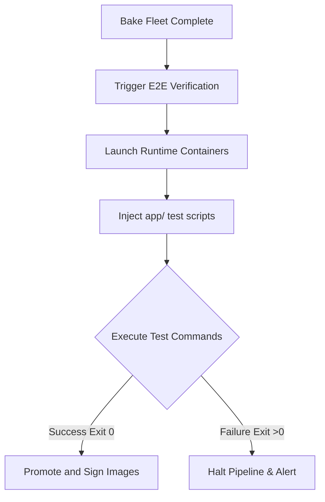

# E2E Fleet & Smoke Testing Framework

This guide documents the End-to-End (E2E) testing framework, explaining how language-specific runtime stacks are validated, the design of the smoke test scripts in the `app/` directory, and how to execute verification locally and in CI/CD pipelines.

---

## 1. The Smoke Test Design (`app/`)

Every language runtime assembled via this framework is verified against a corresponding smoke test script in the **[app/](../app)** folder. These tests go beyond simple "Hello World" scripts; they are designed to assert that critical core capabilities and compiled shared libraries (from our C/C++ CC layer) load and function correctly.

| Test File | Target Runtime | Verified Capabilities |
| :--- | :--- | :--- |
| `test.py` | **Python** | SSL/TLS connection (`urllib`), SQLite binding, zlib compression, and multithreading. |
| `test.php` | **PHP** | FFI bindings, mbstring manipulation, SQLite database interactions, and OpenSSL curl client execution. |
| `test.pl` | **Perl** | POSIX compliance, core module loading, and dynamic linkage of `libcrypt.so` (`libxcrypt`). |
| `test.js` | **Node.js** | Event loop execution, crypto module hashing, and zlib library compression. |
| `test.java` | **Java** | Dynamic class loading, filesystem directory walks, and standard runtime execution. |
| `test-dotnet.cs` | **.NET** | Core runtime bootstrap, System IO operations, and standard output streaming. |
| `test.go` | **Go** | Concurrency channels, network assembly, and raw system execution. |

---

## 2. Local E2E Verification

To verify that your custom-built images are 100% compliant and stable before pushing them to the remote repository, you can execute the smoke tests locally using Docker. 

When you build a standard or `:debug` stack image, the smoke tests from `app/` can either be mounted directly or copied inside.

### Standard Verification Syntax
Use the following commands to run the smoke tests against your local images:

#### Python Stack
```bash
docker run --rm -v $(pwd)/app:/app ghcr.io/mbuccarello/python-distroless:latest python3 /app/test.py
```

#### PHP Stack
```bash
docker run --rm -v $(pwd)/app:/app ghcr.io/mbuccarello/php-distroless:latest php /app/test.php
```

#### Perl Stack
```bash
docker run --rm -v $(pwd)/app:/app ghcr.io/mbuccarello/perl-distroless:latest perl /app/test.pl
```

#### Java Stack
```bash
docker run --rm -v $(pwd)/app:/app ghcr.io/mbuccarello/java-distroless:latest java /app/test.java
```

#### Node.js Stack
```bash
docker run --rm -v $(pwd)/app:/app ghcr.io/mbuccarello/nodejs-distroless:latest node /app/test.js
```

---

## 3. CI/CD Fleet Verification Workflow

In the GitHub Actions supply chain, E2E validation is orchestrated via the **`distroless-e2e-fleet.yml`** workflow. This represents the final verification gate before images are promoted to production.



### The CI Execution Chain
1. **Dynamic Mounting**: The pipeline checks out the repository and mounts the `app/` directory into the fresh, minimally compiled target container.
2. **System Assertions**: The container executes the exact dynamic language CLI command (e.g. `php /app/test.php`) inside a non-privileged shell.
3. **Linkage Validation**: The execution checks if any required shared libraries (like `libxcrypt`, `libffi`, or `libedit`) are missing, catching issues that static analysis might overlook.
4. **Supply Chain Gate**: If the test command exits with a non-zero status code, the supply chain halts immediately, preventing insecure or broken runtimes from being signed and pushed.
