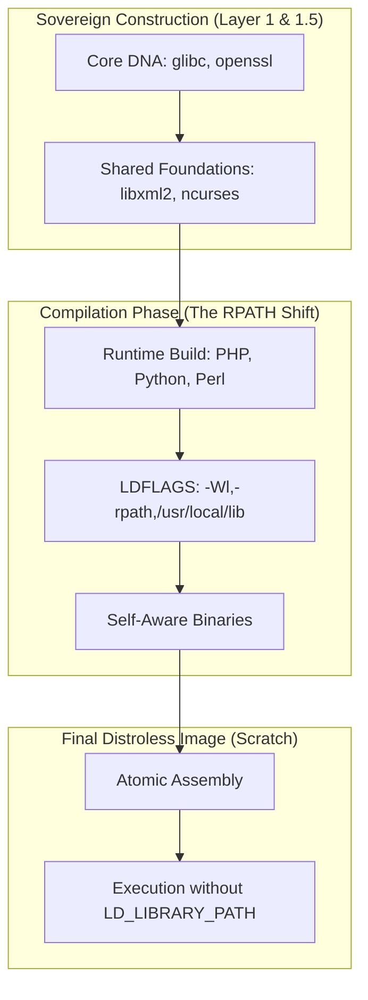

[<- Back to Main README](../README.md)

# Architectural Evolution: From Manual Composition to Native Discovery

This document details the architectural shifts encountered during the stabilization of the Opensource Distroless runtimes, specifically addressing the dynamic linker challenges for high-performance runtimes like .NET, Node.js, and Java.

## 1. The Initial Problem: Fragmented Library Paths
Our initial "Undistro" strategy was to build foundational components (Glibc, OpenSSL, Zlib) from source and place them in standard locations. However, Fedora 40 (our base for artifacts) uses a strict separation between `/usr/lib` (32-bit) and `/usr/lib64` (64-bit).

**Symptoms:**
- .NET runtime could not find `libssl.so.3` despite it being present in `/usr/lib`.
- LD_LIBRARY_PATH was required, breaking the "zero-config" goal of the project.

## 2. Phase 1: Manual Unification (The "Failed Hack")
To resolve the discovery issues, we attempted to force all libraries into a single path (`/usr/lib`) and use symlinks for compatibility.

**Why it failed:**
- **Architecture Mismatch:** By moving everything to `/usr/lib`, we inadvertently mixed 64-bit source-built libraries with 32-bit RPM-provided dependencies. This led to the `ELFCLASS32` error (wrong ELF class).
- **Docker Tooling Limitations:** Using a minimal BusyBox-based "bootstrap" image made it impossible to use advanced Linux composition tools like `ldconfig` or `chroot`.
- **COPY Conflicts:** Docker cannot `COPY` a directory onto a destination that is already a symlink, leading to pipeline crashes.

## 3. Phase 2: Native Library Discovery (The "Enterprise Transition")
We realized that manually managing symlinks is not sustainable for complex runtimes. We transitioned to the standard Linux mechanism for library discovery.

### Key Changes:
1.  **Introduction of `ldconfig`:** Instead of symlinks, we now generate a binary `/etc/ld.so.cache`. This file acts as a "map" that tells the dynamic linker exactly where to find every library, regardless of whether it is in `lib`, `lib64`, or `usr/local/lib`.
2.  **Fedora-based Extractor:** We swapped the minimal BusyBox extractor for a temporary `fedora:40` stage during assembly. 
    - *Note:* This does **not** affect the final image size or security, as the final stage is still `FROM scratch`. 
    - It simply provides the "real" tools needed to prepare a high-assurance rootfs.
3.  **Clean FHS Structure:** We reverted to the standard Filesystem Hierarchy Standard (FHS). Libraries stay in their native architecture-specific folders, maintaining compatibility with 64-bit binary expectations.

## 4. Current Architecture Overview

## 5. Benefits and Trade-offs
- **Pros:** 100% reliable library loading, zero `LD_LIBRARY_PATH` required, full compatibility with 64-bit runtimes, cleaner Dockerfiles.
- **Cons:** Slightly more complex assembly workflows (using Fedora as extractor).
- **Compliance:** Maintains SLSA compliance as all source-built artifacts are still verified via Cosign before assembly.

## 6. Phase 3: Sovereign Runtime Compilation (The "Sovereign" Goal)
We transitioned from extracting interpreters from Fedora RPMs to building them from source (Python 3.12, PHP 8.3, Perl 5.38).

### The RPATH Strategy: Self-Contained Discovery
In Phase 2, we relied on `ldconfig` to create a global `/etc/ld.so.cache`. While effective, we wanted to achieve even higher levels of isolation for sovereign runtimes.

**Solution: Hardened RPATH**
We now inject `-Wl,-rpath,/usr/local/lib:/artifacts/lib` directly into the binaries during the compilation phase.
- **Benefit**: The binary is "self-aware" of its library search paths. It does not require a global cache or `LD_LIBRARY_PATH`.
- **Reliability**: This eliminates the "library not found" errors that plague minimal container environments.
- **Independence**: The runtime is 100% independent from the host OS layout, achieving the project's ultimate goal of a bit-perfect, sovereign product.

---
## 7. Phase 4: Enterprise LTS Hardening (Current)
We are now applying the sovereign high-assurance model to the project's most complex enterprise runtimes.

### Key Objectives:
1.  **LTS Upgrades**: Transitioning to Long-Term Support versions (OpenJDK 21, Node.js v22, .NET 8.0).
2.  **Sovereign Foundations**: Ensuring these heavy runtimes link exclusively against our project-built `glibc`, `openssl`, and `zlib`.
3.  **Cryptographic Integrity**: Mandating Keyless Signing (Cosign) and SLSA Level 3 Provenance for every image in the stack.

*This document serves as a record of our team's technical journey and a reference for future architectural decisions.*
