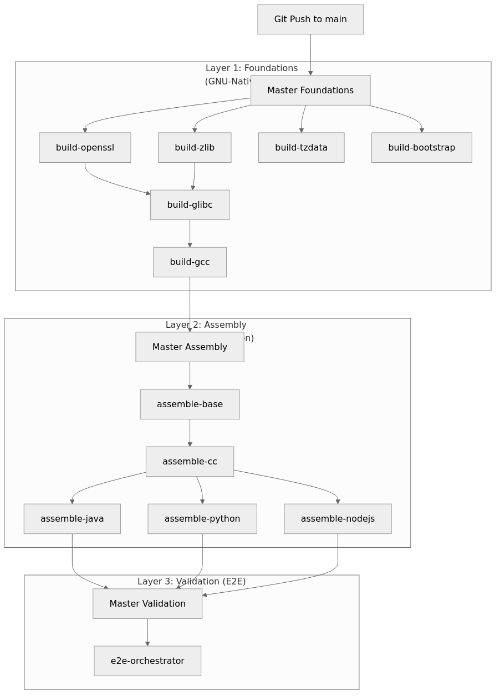

# Technical Specification: System Architecture

Distroless The Hard Way implements a modular, Decoupled Component Architecture (DCA) to achieve a zero-trust supply chain. The system is designed to provide bit-perfect reproducibility and cryptographic transparency by eliminating reliance on pre-compiled host OS binaries.

---

## 1. Pipeline Lifecycle Specification (Layered Master Model)

The build process is managed by a three-tier Master Orchestration system. This structure eliminates race conditions by enforcing strict sequentiality between architectural layers.

### Stage 0: Mirror Registry Isolation
To ensure absolute infrastructure resilience and prevent upstream rate-limiting, the system utilizes a local caching tier.
*   **Mandate**: No build environment (Alpine, Fedora) is pulled directly from external registries during library compilation.
*   **Standard**: All build sandboxes must originate from the internal `ghcr.io` mirror.

### Stage 1: Zero-Trust Bootstrap Utility
Assembly of a root filesystem within a `FROM scratch` container requires a self-contained execution toolkit.
*   **Decoupled Requirement**: The system prohibits the use of host-provided `tar`, `sh`, or `mkdir` utilities during image construction.
*   **Specification**: A 100% static, GNU-based BusyBox binary is compiled from source. This utility provides the minimal syscall interface needed for layer extraction and configuration (e.g., `/etc/passwd` generation).

### Stage 2: The GNU-Native Build Strategy
The system enforces strict library compatibility by aligning the build host with the target C implementation.
*   **Glibc Requirement**: Foundational components dependent on the GNU C Library (Glibc, OpenSSL, Zlib) are compiled within a Glibc-native sandbox (Fedora).
*   **Linkage Standard**: Static libraries are utilized where possible, and dynamic libraries are packaged as atomic OCI artifacts to maintain layer integrity.

---

## 2. Security Gateways & Controls

Each component must pass a sequential set of security checkpoints before promotion to the intermediate registry:

1.  **Source Integrity**: Cryptographic SHA-256 verification of raw source archives.
2.  **Static Analysis (SAST)**: Semgrep auditing to detect memory corruption patterns and insecure API usage.
3.  **Binary Attribution**: SLSA Level 3 attestations linking the hashed artifact to the originating build environment and source commit.
4.  **Identity Verification**: Keyless signing (Cosign/Sigstore) tied to the GitHub Action OIDC workload identity.

---

---

## 4. Hybrid Provenance Strategy (The Official Path)

To balance the core requirement of "The Hard Way" (bit-perfect integrity) with the objective of "Zero-Compilation" in the assembly phase, the system implements a dual-path acquisition strategy for language runtimes.

### Type A: Native Binary Alignment (Java, Node.js, .NET)
For projects that publish official, standalone binary distribution tarballs, the system performs a direct download from the project's primary mirror.
- **Verification**: Strict cryptographic pinning against official project manifest metadata (e.g., Node.js SHASUMS256, Adoptium API).
- **Benefit**: Ensures the runtime is exactly as intended by the language maintainers without any intermediary modification.

### Type B: OS-Native Package Extraction (Python, PHP, Perl)
For projects that officially distribute only source code (requiring OS-level compilation), the system extracts binaries from **Official Fedora 40 Repositories**.
- **Process**: The system uses the `base-fedora` sandbox to fetch official RPMs via `dnf download --resolve`. These RPMs are then extracted in the runner using `rpm2cpio`.
- **Integrity**: Leverages the binary signing and security patching provided by the Fedora Project maintainers.
- **Alignment**: Ensures 100% ABI compatibility with the `glibc` and core libraries established in Stage 2 (Foundations).

---

For a complete mapping of library inheritance and the roadmap for transitioning components to full native source builds, refer to the [Library Hierarchy & Build Roadmap](lib-hierarchy.md).
