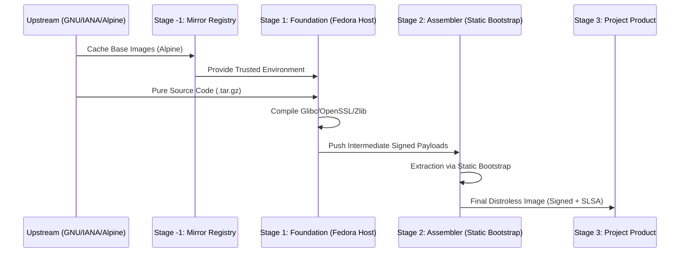

# Architecture: Total Isolation & Zero-Trust Lifecycle

Distroless The Hard Way implements a **decoupled, multi-stage artifact lifecycle** designed to eliminate external dependencies and ensure bit-perfect supply chain integrity.

---

## 1. The High-Level Lifecycle

Our architecture is split into four distinct stages to separate build concerns from assembly concerns.

---

## 2. Technical Pillars

### Stage -1: Mirror Isolation
To achieve **Total Isolation**, we no longer pull the base Alpine image directly from Docker Hub during multiple builds. This prevents `ToManyRequests` rate limits and ensures that even if an upstream image is deleted, our pipeline remains operational.
- **Workflow**: `mirror-base.yml`
- **Output**: `ghcr.io/mbuccarello/base-alpine:latest`

### Stage 1: The GNU Pivot (Host OS Strategy)
We discovered that building **Glibc** on a **musl-based** host (Alpine) causes severe header conflicts between the two C libraries. 
- **The Fix**: We use **Fedora (glibc-native)** as the build sandbox for foundational libraries. 
- **The Result**: A standard GNU toolchain that generates bit-perfect binaries without macro redefinitions.

### Stage 2: Static Bootstrap Assembler
To maintain a pure **zero-trust** posture, we do not use the host's `tar` or `sh` to assemble the final images.
- **Bootstrapping**: We natively compile a **strictly static BusyBox** (Stage 0).
- **Assembly**: This single, signed binary is the *only* tool allowed to extract components and create the rootfs (e.g., `/etc/passwd`) inside a `FROM scratch` container.
- **Linkage**: By enforcing `CONFIG_STATIC=y`, we ensure the tool runs without requiring any external shared libraries.

---

## 3. Supply Chain Security Gateways

At every stage, we apply the following gates:
1. **Source Integrity**: SHA256 verification of raw `.tar.gz` downloads.
2. **SAST Scan**: Semgrep analysis of the C source code.
3. **SCA & SBOM**: Trivy generation of SPDX records.
4. **Attestation**: SLSA Level 3 provenance linking the binary to the specific commit.
5. **Transparency**: Keyless Sigstore (Cosign) signing of every layer.

---

## 4. Current Pipeline Matrix

| Workflow | Stage | Purpose | Host Environment |
| :--- | :--- | :--- | :--- |
| `mirror-base.yml` | -1 | Registry Isolation | Ubuntu |
| `build-bootstrap.yml` | 0 | Assembly Tooling | Alpine -> Static |
| `build-glibc.yml` | 1 | C Runtime | Fedora |
| `assemble-base.yml` | 2 | OS Construction | Scratch (Static) |
