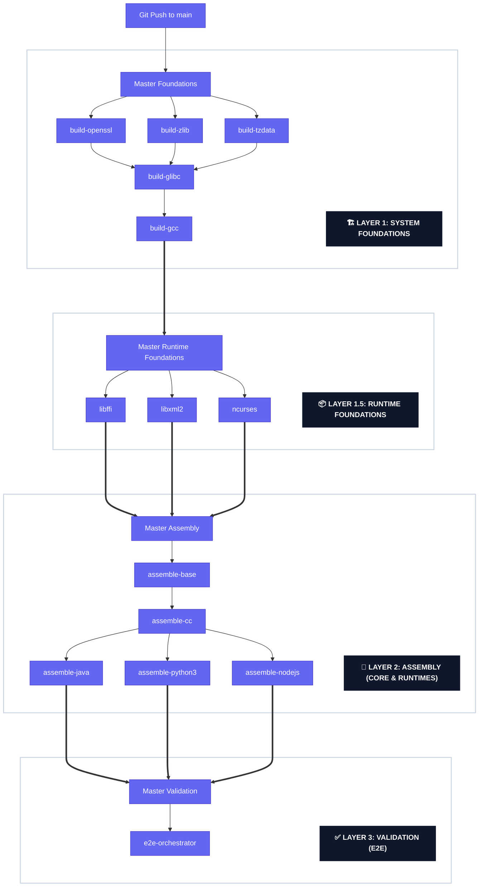

[<- Back to Main README](../README.md)

# Technical Specification: System Architecture

Distroless The Hard Way implements a modular, Decoupled Component Architecture (DCA) to achieve a zero-trust supply chain. The system is designed to provide bit-perfect reproducibility and cryptographic transparency by eliminating reliance on pre-compiled host OS binaries.

---

## 1. Pipeline Lifecycle Specification (The 4-Tier Master Model)

The build process is managed by a four-tier Master Orchestration system. This structure ensures absolute sequentiality and cryptographic provenance from raw source to final runtime, achieving **Total Decoupling** from host OS package managers.

### Stage 1: System Foundations (GNU-Native)
Raw source code archives (Glibc, OpenSSL, TZData) are verified and compiled into standalone OCI artifacts.
*   **Sandbox Rationale**: Fedora containers are utilized strictly as compilation sandboxes to provide the standard GNU toolchain.
*   **Output**: Pure binary payloads without OS metadata.

### Stage 1.5: Runtime Foundations (Shared Libraries)
Intermediate shared libraries (libxml2, libffi, ncurses, etc.) required by language runtimes.
*   **Sovereign Linking**: These libraries are compiled from source and linked against the Stage 1 `glibc` and `openssl` artifacts.
*   **OCI Distribution**: Distributed as OCI "packages", allowing Layer 2 to assemble them without re-compilation.

### Stage 2: Core Assembly (OCI Roots)
Foundational payloads are merged into the final OCI root filesystems.
*   **Sovereign Netbase**: Manual construction of `/etc/services` and `/etc/protocols` eliminates the `netbase` RPM.
*   **Atomic Construction**: Uses `FROM scratch` to ensure zero host-OS leakage.

### Stage 3: Language Runtimes (Hardened Execution)
Language-specific environments (Java, Node.js, Python, etc.) built on top of Stage 2.
*   **RPATH Strategy**: Binaries are built with `-Wl,-rpath` to ensure they discover sovereign libraries in `/usr/local/lib` and `/artifacts/lib`.

---

## 2. OCI-Native "Package" Model (Total Decoupling)

Distroless The Hard Way replaces traditional OS-bound package managers (`dnf`, `apt`) with a high-assurance **OCI-Native Package Model**.

### 2.1 OCI Artifacts as Sovereign Packages
Each component is an independent OCI image. This provides:
*   **Immutable Versioning**: Handled via OCI digests.
*   **Registry-as-DB**: The GitHub Container Registry serves as the package database.
*   **Zero-Footprint Runtime**: The final image contains zero package manager metadata, reducing the attack surface by 100% compared to traditional minimal images.

---

## 3. The RPATH Philosophy: Self-Aware Binaries

To achieve absolute relocatability and independence, we utilize the **Hardened RPATH** strategy.
*   **Mechanism**: The library search path is baked into the ELF header of the binary during compilation.
*   **Result**: The runtime discovers its dependencies (e.g., `libssl.so.3`) within our sovereign library paths without requiring `LD_LIBRARY_PATH` or a global `/etc/ld.so.cache`.
*   **Isolation**: This ensures that even if a host OS library were present, our sovereign library would be prioritized by the dynamic linker.

---

## 4. Security Gateways and Controls

Each layer must pass a sequential set of security checkpoints:
1.  **Source Integrity**: Cryptographic SHA-256 verification of raw source.
2.  **SAST Audit**: Semgrep auditing of source code.
3.  **Trivy SCA**: Automated Bill-of-Materials (SBOM) generation.
4.  **Keyless Signing**: Cosign verification tied to GitHub OIDC identity.
5.  **SLSA Level 3**: Build provenance attestations.

---

## 5. Technical Transparency

### 5.1 The "Workshop" vs. The "Product"
*   **The Workshop (Fedora 40)**: Used strictly for compilation tools (GCC, Make).
*   **The Product (Scratch)**: The final image is a bit-perfect assembly of our source-built artifacts. It contains **zero** binaries or metadata from the Fedora workshop.

### 5.2 Sovereign Definition
A component is **Sovereign** if it is derived from verified upstream source, natively compiled against our foundations, and assembled into a scratch container without OS package intermediaries.

---

For a complete mapping of library inheritance and the roadmap for transitioning components to full native source builds, refer to the [Library Hierarchy & Build Roadmap](lib-hierarchy.md).
