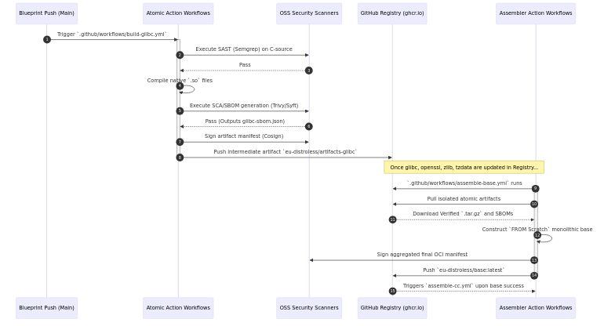

# Architecture: Decoupled Components

The idea is to compiling different base immage layer like in the google distr4oless bazel build, compiling `base`, `cc`, and `java` layers independently without extracting pre-compiled Ubuntu or Debian packages like the standard Google Distroless model.

---

## The Open-Source Security Gateways (SAST & SCA)

In a monolithic build, determining *where* a vulnerability originated in the final image is nearly impossible. By isolating every foundational library (`glibc`, `openssl`, `zlib`, `gcc`) into its own discrete GitHub Action pipeline (`build-<library>.yml`), Opensource-Distroless enforces aggressive, component-level security gating:

1. **Source Download:** The workflow `curl`s the specific C-code from the GNU FTP or Github.
2. **SAST Scan (`Semgrep` / `Cppcheck`):** Before compiling, the raw C-code is statistically scanned for buffer overflows, memory leaks, and known malicious manipulation patterns.
3. **Compilation:** The artifact is mathematically compiled natively (with timestamps stripped for reproducibility).
4. **SCA & SBOM (`Trivy` / `Syft`):** The output `.tar.gz` binary is scanned against CVE databases, and a bespoke Software Bill of Materials (SBOM) is digitally generated exclusively for this single component.
5. **Signing & Push (`Cosign`):** The artifact is wrapped in an intermediate `FROM scratch` OCI Blob, signed securely using GitHub OIDC keyless infrastructure, and pushed to `ghcr.io/opensource-distroless/artifacts-<name>`.

If *any* of those gateways fail—for example, if a severe CVE is found in `zlib`—that specific workflow halts immediately. The compromised artifact is never pushed, protecting the overall `base` image from contamination.

**Detailed Step-by-Step Atomic Pipeline Guides:**
*   [**`build-glibc.yml`**](pipelines/build-glibc.md)
*   [**`build-openssl.yml`**](pipelines/build-openssl.md)
*   [**`build-zlib.yml`**](pipelines/build-zlib.md)
*   [**`build-tzdata.yml`**](pipelines/build-tzdata.md)
*   [**`build-gcc.yml`**](pipelines/build-gcc.md)

---

## Pipeline Orchestration

Once the atomic foundational components are vetted and published to the Container Registry as isolated OCI blobs, the "Assembler Workflows" combine them chronologically.

### The Assemblers
*   [**`assemble-base.yml`**](pipelines/assemble-base.md): Retrieves the signed `glibc`, `openssl`, `zlib`, and `tzdata` intermediate payloads from `ghcr.io`. It verifies their Cosign signatures, merges them over an empty root filesystem, and publishes the operational OS standard `opensource-distroless/base`.
*   [**`assemble-cc.yml`**](pipelines/assemble-cc.md): Triggers upon the base completion. Fetches the verified `gcc` (libstdc++) artifact and layers it.
*   [**`assemble-java.yml`**](pipelines/assemble-java.md): Layers the pre-compiled OpenJDK binary runtime on top of the Opensource Distroless CC environment.
*   [**`assemble-nodejs.yml`**](pipelines/assemble-nodejs.md): Verified Node.js LTS layer.
*   [**`assemble-python3.yml`**](pipelines/assemble-python3.md): Standalone Python 3.12 layer.
*   [**`assemble-dotnet.yml`**](pipelines/assemble-dotnet.md): .NET 8.0 Runtime layer.
*   [**`assemble-php.yml`**](pipelines/assemble-php.md): PHP 8.3-FPM layer.
*   [**`assemble-perl.yml`**](pipelines/assemble-perl.md): Perl 5.38 layer.
