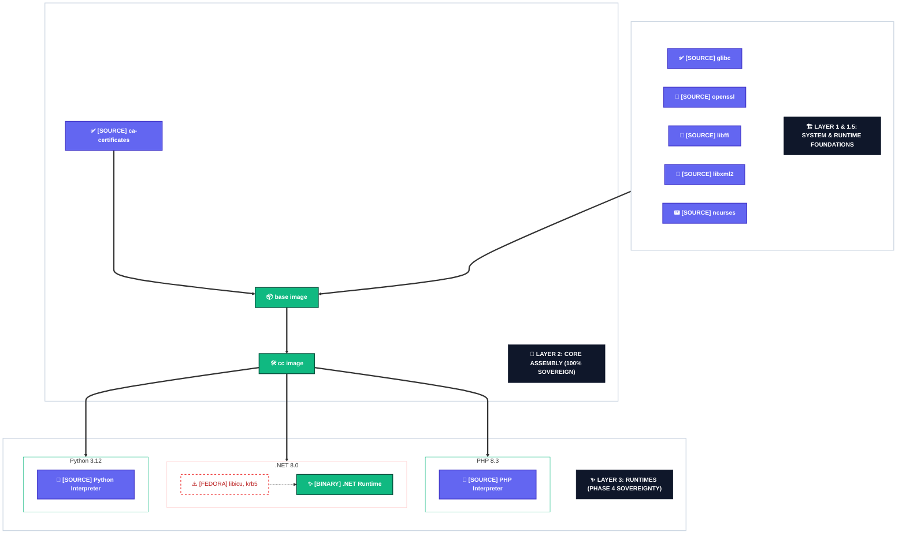

[<- Back to Main README](../README.md)

# Library Hierarchy & Build Roadmap

This document maps the shared libraries across the Opensource Distroless hierarchy. It distinguishes between components built natively from source ("The Hard Way") and transitional components.

## 1. Architectural Hierarchy Graph

## 2. Sovereignty Status: Total Decoupling

As of Phase 4, the project has achieved **Total Decoupling** for all primary language runtimes. We no longer extract interpreters or core libraries from Fedora RPMs.

## 3. Library Status Matrix

| Component | Status | Origin | Image | Category |
|-----------|--------|--------|-------|----------|
| `libc.so.6` | Source | GNU Source | `base` | Foundation |
| `libssl.so.3` | Source | OpenSSL Source | `base` | Foundation |
| `libz.so.1` | Source | Zlib Source | `base` | Foundation |
| `libstdc++.so.6` | Source | GCC Source | `cc` | C++ Layer |
| `libgcc_s.so.1` | Source | GCC Source | `cc` | C++ Layer |
| `libgomp.so.1` | Source | GCC Source | `cc` | C++ Layer |
| `ca-certificates` | Source | Mozilla NSS | `static` | Security |
| `tzdata` | Source | IANA Source | `static` | Configuration |
| `libffi.so` | Source | Libffi Source | `L1.5` | Foundation |
| `libxml2.so` | Source | Libxml2 Source | `L1.5` | Foundation |
| `libonig.so` | Source | Oniguruma Source | `L1.5` | Foundation |
| `libsqlite3.so` | Source | SQLite Source | `L1.5` | Foundation |
| `libreadline.so` | Source | Readline Source | `L1.5` | Foundation |
| `libncurses.so` | Source | Ncurses Source | `L1.5` | Foundation |
| `libxcrypt.so` | Source | Libxcrypt Source | `base` | Foundation |
| `libicu*.so` | Fedora Extract | Fedora 40 | `dotnet` | Transitional |
| `libkrb5.so` | Fedora Extract | Fedora 40 | `dotnet` | Transitional |

---

## 4. Build From Source Roadmap (Phase 4 Progress)

### Priority 1: Core System Utilities (In Progress)
- [ ] **libicu**: Compile Unicode components from source to remove Dotnet's remaining dependency on Fedora RPMs.
- [ ] **libkrb5 (GSSAPI)**: Native compilation of Kerberos libraries to support advanced networking.

### Priority 2: Runtime Foundations (Completed)
- [x] **libffi / libxml2**: Native builds for Python and PHP.
- [x] **ncurses / readline**: Native terminal handling for CLI runtimes.
- [x] **sqlite / oniguruma**: Native builds for database and regex support.

### Priority 3: Full Runtime Bootstrapping (Completed)
- [x] **Python 3.12**: 100% source-built, linked against sovereign foundations.
- [x] **Perl 5.38**: 100% source-built, linked against sovereign foundations.
- [x] **PHP 8.3**: 100% source-built, linked against sovereign foundations.

---

## 5. Transitional Dependency Mapping (.NET Only)

While the core runtimes are 100% sovereign, the .NET 8 flavor still requires two specialized libraries from Fedora to ensure full globalization support. These are injected into the **CC Image** base.

### ✨ .NET 8 Flavor (Hardened)
- `libicu`: Unicode and globalization support (extracted from Fedora 40).
- `krb5-libs`: Kerberos and GSSAPI support (extracted from Fedora 40).
- **Hardening**: These are verified against our sovereign `glibc` and `openssl` during assembly.
