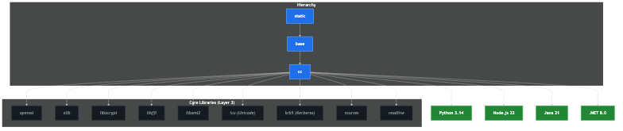

# Library Hierarchy & Build Roadmap

This document maps the shared libraries across the Opensource Distroless hierarchy. It distinguishes between components built natively from source ("The Hard Way") and those currently extracted from Fedora for convenience.

## 1. Architectural Hierarchy Graph

## 2. Transparency Note: Transitional Components

The status **Fedora Extract** indicates a **transitional state**. These components are currently extracted from official Fedora repositories to ensure ABI compatibility while native "Hard Way" compilation pipelines are developed. The project objective is to transition every "Fedora Extract" component to "Source" status.

## 3. Library Status Matrix

| Component | Status | Origin | Image | Category |
|-----------|--------|--------|-------|----------|
| `libc.so.6` | Source | GNU Source | `base` | Foundation |
| `libssl.so.3` | Source | OpenSSL Source | `base` | Foundation |
| `libz.so.1` | Source | Zlib Source | `base` | Foundation |
| `libstdc++.so.6` | Source | GCC Source | `cc` | C++ Layer |
| `libgcc_s.so.1` | Source | GCC Source | `cc` | C++ Layer |
| `libgomp.so.1` | Source | GCC Source | `cc` | C++ Layer |
| `ca-certificates` | Source | Mozilla NSS | `static` | Security |
| `tzdata` | Source | IANA Source | `static` | Configuration |
| `libicu*.so` | Fedora Extract | Fedora 40 | `dotnet` | Dotnet Runtime |
| `libkrb5.so` | Fedora Extract | Fedora 40 | `dotnet` | Networking |
| `libffi.so` | Source | Libffi Source | `python` | Foundation |
| `libxml2.so` | Source | Libxml2 Source | `php` | Foundation |
| `libonig.so` | Source | Oniguruma Source | `php` | Foundation |
| `libsqlite3.so` | Source | SQLite Source | `php` | Foundation |
| `libreadline.so` | Source | Readline Source | `python` | Foundation |
| `libbz2.so` | Source | Bzip2 Source | `python` | Foundation |
| `liblzma.so` | Source | XZ Source | `python` | Foundation |
| `libxcrypt.so` | Source | Libxcrypt Source | `base` | Foundation |

---

## 3. Build From Source Roadmap

The following components are currently extracted from Fedora for convenience and are candidates for future "Hard Way" native compilation pipelines.

### Priority 1: Core System Utilities
- [ ] **libicu**: Compile Unicode components from source to remove Dotnet's dependency on Fedora RPMs.
- [ ] **libkrb5 (GSSAPI)**: Native compilation of Kerberos libraries to support advanced networking.

### Priority 2: Runtime Dependencies (Completed)
- [x] **libffi**: Native build for Python foreign function interface.
- [x] **libxml2 / libedit**: Native builds for PHP and general CLI tools.
- [x] **sqlite / oniguruma**: Native builds for database and regex support.

### Priority 3: Full Runtime Bootstrapping (Completed)
- [x] **Python 3 Interpreter**: Move from Fedora RPMs to a full native source compilation.
- [x] **Perl 5.38 Interpreter**: Move from Fedora RPMs to a full native source compilation.
- [x] **PHP 8.3 Interpreter**: Move from Fedora RPMs to a full native source compilation.

---

## 4. Fedora Dependency Mapping (dnf download)

Each flavor is constructed by taking the **CC Image** as a base and injecting the specific runtime plus its OS-level dependencies. These dependencies are currently extracted from official Fedora RPMs to ensure binary compatibility with the source-built `glibc`.

All libraries are unified into `/usr/lib`. Comprehensive symlinks are provided for `/lib`, `/lib64`, and `/usr/lib64` to ensure maximum compatibility for 64-bit runtimes without requiring `LD_LIBRARY_PATH` or complex `ld.so.conf` configurations, following the **Undistro** principle of simplicity and high-assurance.

### 🐍 Python 3 Flavor
- `python3`, `python3-libs`: Core interpreter and standard library.
- `libffi`, `expat`, `readline`: Runtime support.
- `sqlite-libs`, `gdbm-libs`, `libdb`: Storage backends.
- `libnsl2`, `libtirpc`, `libxcrypt`: Legacy and encryption support.
- `openssl-libs`, `zlib`: Networking and compression (transitional).

### ✨ .NET 8 Flavor
- `libicu`: Unicode and globalization support (required for runtime start).
- `krb5-libs`: Kerberos and GSSAPI support for advanced networking.

### 🐘 PHP 8.3 Flavor
- `php-cli`, `php-common`, `php-xml`: Core interpreter and XML module.
- `libxml2`, `pcre2`: XML parsing and regex engine.
- `libedit`, `ncurses-libs`: CLI interaction.
- `xz-libs`, `bzip2-libs`: Compression support.

### 🐪 Perl 5.38 Flavor
- `perl-interpreter`, `perl-libs`: Core interpreter.
- `perl-HTTP-Tiny`, `perl-IO-Socket-SSL`: SSL/Networking support.
- `libxcrypt`, `gdbm-libs`: Utility libraries.
