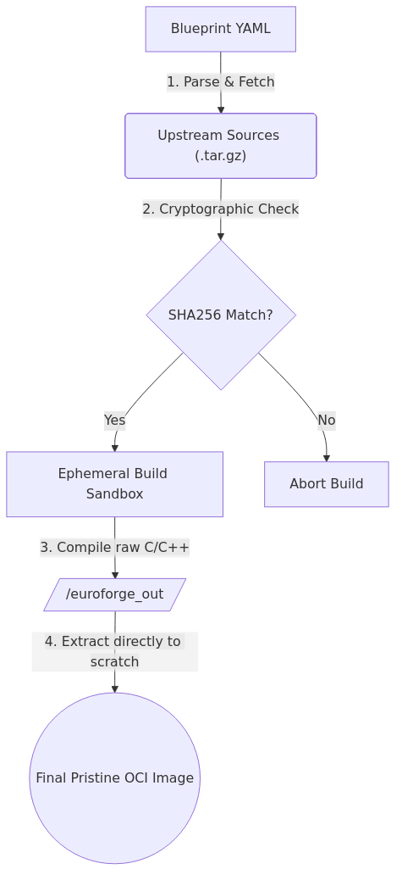
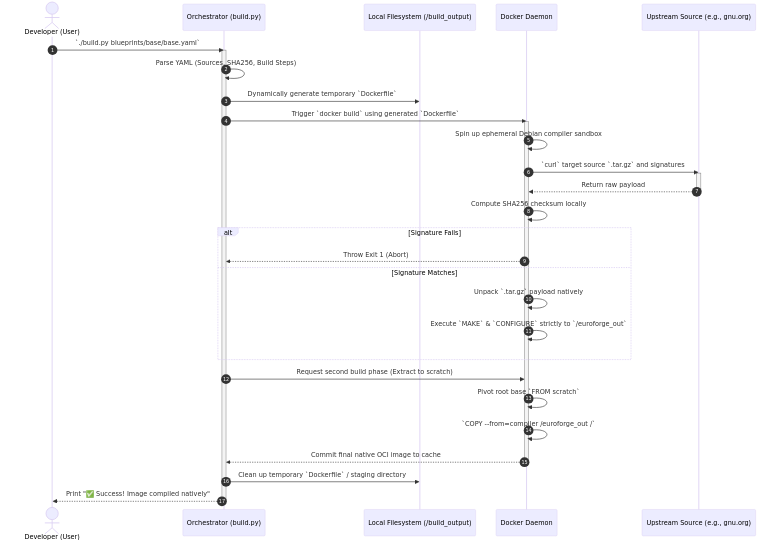
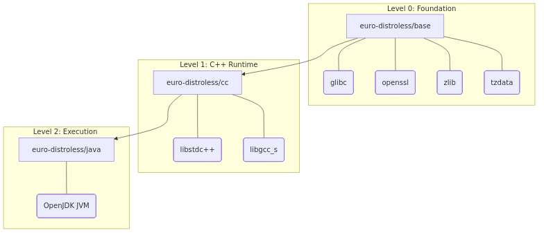

# Architecture: The Distroless-The-Hard-Way Engine

This document details the underlying mechanics and explicit intent of the Distroless-The-Hard-Way paradigm, which enforces a hybrid **Distroless The Hard Way Source-to-OCI** workflow.

## Vision: Democratizing Distroless for the World
The prevailing container security model, popularized by Google Distroless, relies fundamentally on extracting pre-compiled binaries from upstream OS brokers like Debian or Ubuntu. "Distroless" container images are typically created by structurally parsing these specific 3rd-party repositories and simply 'extracting' the binary contents without verification.

Distroless-The-Hard-Way is constructed with a single, aggressive intent: **To democratize and repatriate Distroless container architectures within the world.** 
By forcing the infrastructure to natively fetch, vet, and cryptographically compile `glibc`, `libstdc++`, and cryptographic software from pure, agnostic source code internally within an ephemeral sandbox, organizations instantly become the absolute, uncompromised monolithic authors of their own root computational engines—achieving zero-trust supply chain isolation independent of foreign distributions.

---

## 1. Core Component Workflow

The Distroless-The-Hard-Way orchestrator (currently `build.py`, progressing to a Go-based `cmd/sovereignforge`) handles the entire lifecycle of an image.

### Chronological Orchestrator Sequence
The orchestrator leverages the local Docker daemon purely as an ephemeral sandbox, enforcing rigorous cryptographic checking before executing source compilation dynamically into the output artifact.

### Phase 1: Cryptographic Ingestion
The engine parses the `.yaml` Blueprint. The most critical step is `Phase 1`. The engine intercepts upstream source code (`.tar.gz`) from raw sites like `ftp.gnu.org` or `github.com`. It instantly halts if the downloaded `sha256` signature mismatches the one statically audited in your Blueprint.

### Phase 2: The Ephemeral Sandbox (`bwrap` / Docker)
To compile C-source code, you need a compiler (`gcc`, `make`). 
Distroless-The-Hard-Way dynamically spins up an ephemeral sandbox container. **This sandbox container is strictly a factory.** None of the Alpine or Debian packages used to bootstrap the sandbox are ever allowed into the final image.

### Phase 3: Deterministic Compilation
Inside the sandbox, the blueprint's `build_steps` execute. Software is instructed to compile and install themselves exclusively into the mathematically isolated `/sovereignforge_out/` directory using flags like `DESTDIR=/sovereignforge_out` or `--prefix=/sovereignforge_out/usr`.

### Phase 4: Native OCI Packaging
The orchestrator skips Docker entirely for the final step. It compresses the `/sovereignforge_out/` directory into a pristine `layer.tar.gz`. Because there is no underlying operating system or shell, the vulnerability scanner profile effectively drops to zero. 

---

## 2. The Blueprint Hierarchy (Building the Universe)

Because Distroless-The-Hard-Way rejects inherited Operating Systems, it must build its foundational layers iteratively from scratch.

### Level 0: The Foundational Base (`blueprints/base/base.yaml`)
To run anything complex (like Node or Java), a container needs a C-library and basic utilities.
Distroless-The-Hard-Way starts by compiling `glibc`, `openssl`, `zlib`, and `tzdata` simultaneously from raw C-sources in the `base.yaml` blueprint. The output is saved as `sovereign-distroless/base`, mirroring the lowest denominator of Google Distroless.

### Level 1: The C++ Runtime (`blueprints/cc/cc.yaml`)
Modern runtimes like JVM and v8 engine strictly require GNU C++ runtime libraries (`libstdc++`, `libgcc_s`).
The CC layer explicitly `depends_on: ["sovereign-distroless/base"]` and compiles the GNU gcc source code solely to extract and export these specific generic runtime libraries on top of our `base` OS.

### Level 2: Executable Runtimes (`blueprints/java/java.yaml`)
Higher-level languages define a `depends_on: ["sovereign-distroless/cc"]` relationship. 
When `java.yaml` is built, the orchestrator mounts the `cc` layer, downloads the OpenJDK source tarball (along with an ephemeral Boot JDK), configures the JVM to link against our proprietary `glibc` build, and explicitly stages the JVM binaries locally without Host OS pollution.
